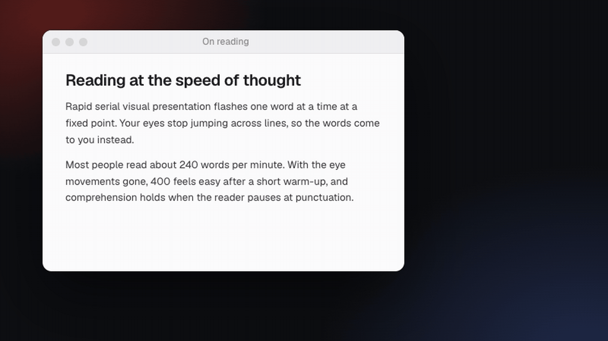

<picture>
  <source media="(prefers-color-scheme: dark)" srcset="docs/readme/hero-dark.svg">
  
</picture>

Read any text on your screen faster. Press a shortcut, drag a box around text like a screenshot,
and a small popup flashes it one word at a time (Rapid Serial Visual Presentation), with optional
read-aloud. Everything runs on-device.

**[Download](https://github.com/MahyarK/wordstrobe/releases/latest)** for macOS 15+ (Apple Silicon and Intel), Windows 10/11 (x64) and Linux (x64 `.deb` and AppImage).



**Status:** v0.2: macOS, Windows and Linux. See [PLAN.md](PLAN.md) for the architecture, specs and roadmap.

## Install

### macOS

1. Download `Wordstrobe_<version>_universal.dmg`, open it and drag **Wordstrobe** to **Applications**.
2. Open Wordstrobe. The app isn't notarized yet, so macOS blocks the first launch: click **Done**, then go to
   **System Settings → Privacy & Security**, scroll down and click **Open Anyway**. Or, in Terminal:
   ```bash
   xattr -dr com.apple.quarantine /Applications/Wordstrobe.app
   ```
3. Wordstrobe lives in the menu bar (no Dock icon) and opens **Settings** on first launch. Under **Permissions**,
   click **Request**, turn Wordstrobe on in **Privacy & Security → Screen & System Audio Recording**, then click
   **Relaunch**.

Updating: quit Wordstrobe from its menu bar icon, replace the app, and grant Screen Recording again (toggle it off
and on). Unsigned builds lose the grant on every update until the app is signed.

### Windows

1. Download and run `Wordstrobe_<version>_x64-setup.exe`. The installer isn't signed yet, so SmartScreen may say
   "Windows protected your PC": click **More info → Run anyway**.
2. Wordstrobe runs in the notification area (system tray). Text recognition uses Windows' built-in OCR, which
   needs a language with OCR support. Most installs have one for the display language; otherwise add one in
   **Settings → Time & language → Language & region**.

### Linux

- **Debian/Ubuntu:** download `Wordstrobe_<version>_amd64.deb` and install it, which also installs Tesseract OCR:
  ```bash
  sudo apt install ./Wordstrobe_*_amd64.deb
  ```
- **Other distributions:** download `Wordstrobe_<version>_amd64.AppImage`, make it executable
  (`chmod +x Wordstrobe_*.AppImage`), and install Tesseract OCR with your package manager (`tesseract-ocr` or
  `tesseract`). Add your language's Tesseract data (e.g. `tesseract-ocr-deu`) to read text in it.
- **Wayland:** apps can't register global shortcuts there, so add a custom shortcut in your desktop's keyboard
  settings that runs `wordstrobe --read-region` (or the AppImage path with `--read-region`). Selection uses your
  desktop's own screenshot picker. On X11, **Alt+Shift+R** works directly.
- Read-aloud isn't available on Linux yet: WebKitGTK has no speech API.

## Use

Press the shortcut (**⌥⇧R** on macOS, **Alt+Shift+R** on Windows and Linux X11) and drag over any text. The popup
appears near the cursor and starts after a short delay. Esc cancels the selection.

| Key | Action | Key | Action |
|---|---|---|---|
| Space / click | play / pause | ↑ / ↓ | ±25 wpm |
| ← / → | previous / next word | 1 / 2 / 3 | words per flash |
| Alt+← / Alt+→ | previous / next sentence | S | read aloud |
| R | restart | T | full text (click a word to jump) |
| ⌘C / Ctrl+C | copy the text | ⌘, / Ctrl+, | settings |
| Esc | close | | |

## Build

Rust and Node 22.18 or later on every platform, plus:

- **macOS:** Xcode 26 or later (the OCR helper uses the macOS 26 SDK).
- **Windows:** the [Tauri prerequisites](https://tauri.app/start/prerequisites/) (MSVC build tools, WebView2).
- **Linux:** `libwebkit2gtk-4.1-dev libxdo-dev libssl-dev libayatana-appindicator3-dev librsvg2-dev libpipewire-0.3-dev
  libclang-dev libgbm-dev libxcb1-dev libxrandr-dev libxcb-randr0-dev libxcb-shm0-dev libdbus-1-dev tesseract-ocr`. Or use the Docker image: `scripts/linux-dev.sh build` (see the script for `test`,
  `e2e` and `shell`).

```bash
npm install
```

```bash
npm run tauri dev
```

`npm test` runs the TypeScript tests and `cargo test --manifest-path src-tauri/Cargo.toml` the Rust ones (on macOS
also `src-tauri/binaries/wordstrobe-ocr-aarch64-apple-darwin --selftest` for the OCR helper). Pushing a `v*` tag
builds the macOS DMG, the Windows installer and the Linux packages into a draft release.

## Spikes

The numbers in the plan come from these. Both need macOS 26 and Xcode:

```bash
swiftc -O -o /tmp/ocr_latency spikes/ocr_latency.swift && /tmp/ocr_latency
```

```bash
swiftc -O -o /tmp/webspeech spikes/webspeech_boundary.swift && /tmp/webspeech
```

## README visuals

`node docs/readme/hero.mjs` regenerates the animated banner (`hero-dark.svg`, `hero-light.svg`).

`node docs/readme/demo.mjs` re-records `demo.gif` after UI changes. It records the real reader page in headless
Chrome, inside the scene and settings from `demo-scene.js`, then encodes it with ffmpeg. It needs Google Chrome
(or `CHROME=/path/to/chrome`) and ffmpeg, and starts Vite itself if it isn't running.
